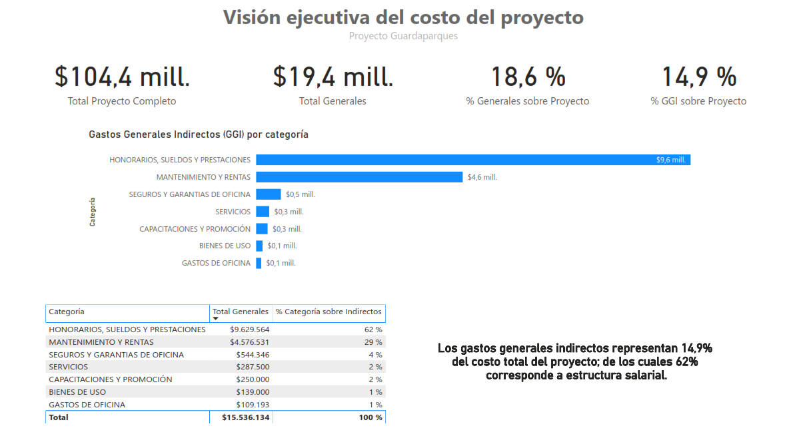
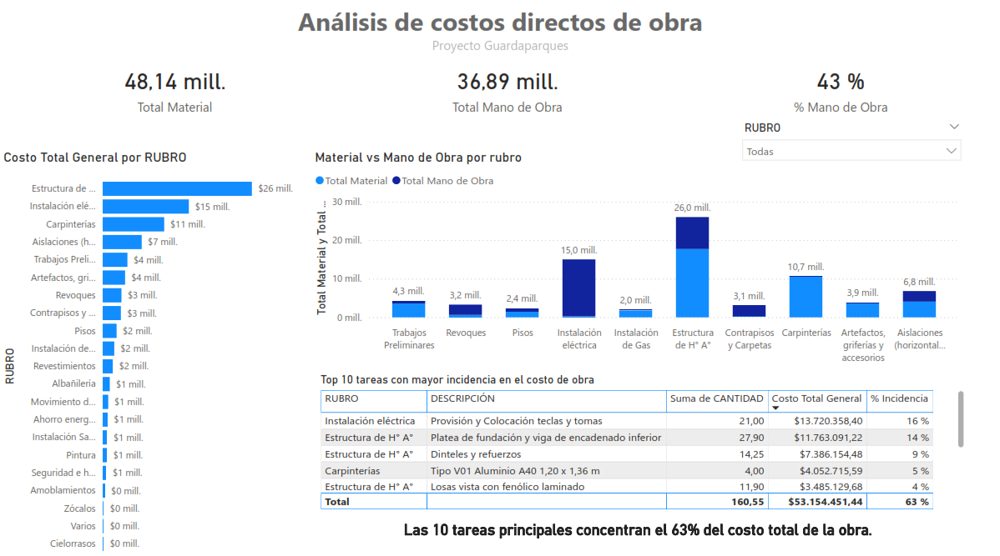
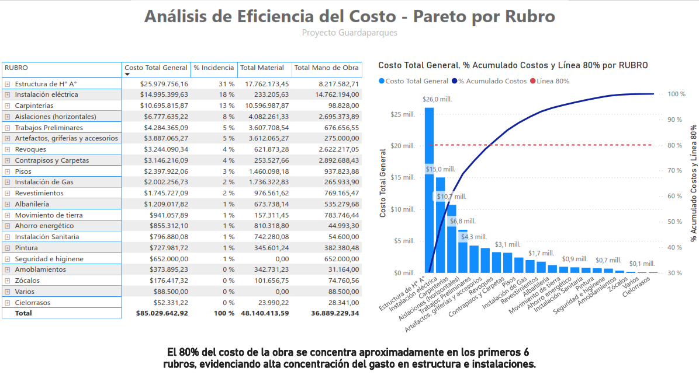

# Análisis de Costos de Obra - Power BI

Dashboard interactivo desarrollado en Power BI para analizar la estructura de costos de un proyecto de construcción y detectar los rubros con mayor incidencia en el presupuesto total.

## Objetivo del proyecto

Analizar la composición del costo de una obra mediante visualizaciones interactivas que permitan identificar los principales factores que impactan en el presupuesto y facilitar la toma de decisiones en la gestión del proyecto.

El análisis se enfoca en comprender:

- Distribución del costo total del proyecto
- Participación de materiales y mano de obra
- Rubros con mayor incidencia en el presupuesto
- Concentración del gasto mediante análisis de Pareto

## Herramientas utilizadas

- Power BI
- Modelado de datos
- DAX
- Visualización de datos

## Estructura del dashboard

El reporte está compuesto por tres páginas principales que permiten analizar el costo del proyecto desde distintas perspectivas.

---

### 1. Visión ejecutiva del costo del proyecto

Esta página presenta un resumen general del presupuesto de la obra mediante indicadores clave (KPIs).

Incluye:

- Costo total del proyecto
- Total de gastos generales
- Porcentaje de gastos generales sobre el proyecto
- Participación de gastos generales indirectos

Visualizaciones incluidas:

- Distribución de gastos generales por categoría
- Comparación entre distintos tipos de gastos indirectos

Esta vista permite obtener rápidamente una comprensión global de cómo se compone el costo total del proyecto.

---

### 2. Análisis de costos directos de obra

Esta sección profundiza en la estructura de los costos directos del proyecto.

Incluye indicadores como:

- Total de material
- Total de mano de obra
- Porcentaje de participación de mano de obra

Visualizaciones incluidas:

- Costo total por rubro de obra
- Comparación entre material y mano de obra por rubro
- Identificación de las tareas con mayor incidencia en el costo

Este análisis permite detectar qué componentes del proyecto tienen mayor impacto económico.

---

### 3. Análisis de eficiencia del costo (Pareto)

En esta página se aplica el principio de Pareto (80/20) para identificar los rubros que concentran la mayor parte del costo total.

Visualizaciones incluidas:

- Costo total por rubro
- Porcentaje acumulado de costos
- Línea de referencia del 80 %

Este análisis permite identificar rápidamente los rubros críticos que explican la mayor parte del presupuesto de la obra.

---

## Principales insights

El análisis permite observar que:

- Una pequeña cantidad de rubros concentra la mayor parte del costo total del proyecto.
- Los rubros estructurales y de instalaciones representan una proporción significativa del presupuesto.
- El análisis de Pareto facilita la identificación de los componentes que explican aproximadamente el 80 % del costo total.

Estas visualizaciones permiten priorizar áreas de control y optimización dentro de la gestión de costos de obra.

---

## Vista del dashboard

### Visión ejecutiva

### Costos directos de obra

### Análisis de Pareto

---

## Archivos del proyecto

- `AnalisisCostos_ViviendaGuardaparques_v01.pbix` → archivo completo del dashboard en Power BI
- `Dashboard_AnalisisCostos.pdf` → versión exportada del dashboard
